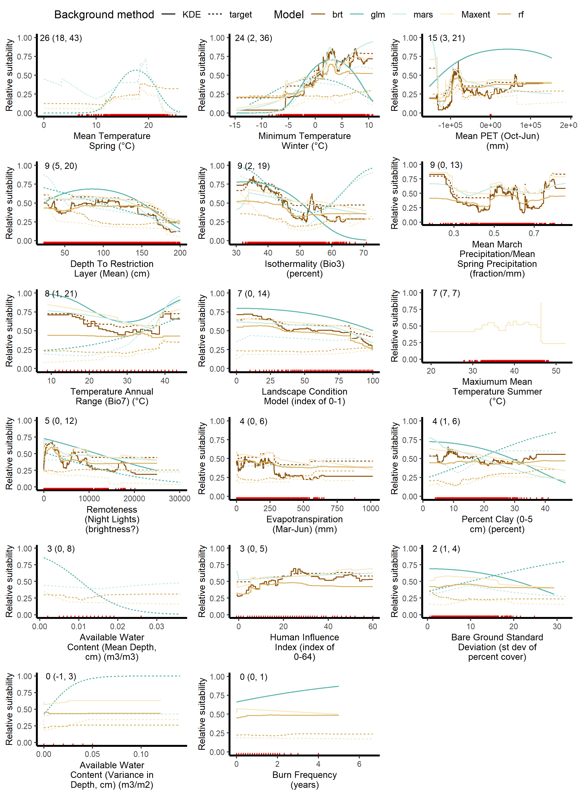

<style type='text/css'>

img {
    max-width: 100%;
    min-height: 100%;
    height: auto;
}

</style>

```{r setup, include=FALSE}
# .libPaths( c( "C:/LocalData/Source/RPackages",.libPaths()))

library(leaflet)
library(flexdashboard)
library(rgdal)
library(shinyWidgets)
library(DT)
library(magrittr)
library(knitr)
library(kableExtra)
library(shinyBS)

mgmt_areas = readOGR("mgmt/mgmt_areas.shp", GDAL1_integer64_policy = T, stringsAsFactors = F)
pred.info = read.csv(file = "predictorInformation.csv", header = T, stringsAsFactors = F, encoding = "ISO-8859-1", fileEncoding = "ISO-8859-1")
states = readOGR("states/cb_2017_us_state_500k_conus_simple.shp", GDAL1_integer64_policy = T)

#Reactive elements
distro_shp = reactive({if(input$known_distro=="yes"){
  kde_poly = readOGR(paste0("species/",gsub(' ','',tolower(input$sp_select)),'/kde.shp',sep=''), verbose = F)
} else {
    kde_poly = NULL
  }})

mess = reactive(
  if(input$mess=='yes'){
    "CONUS_MESS"
  } else {
    "CONUS"})

mgmt_shp = reactive({subset(mgmt_areas, name %in% input$mgmt)})

model = reactive(
  if(input$slider=='0.01'){
    "1st"
  } else if(input$slider=='0.1'){
    "10th"}
    else if(input$slider=='MPP'){
    "MPP"}
    else if(input$slider=='MaxSSS'){
    "MaxSensSpec"
  })

pres_pts = reactive({if(input$pres_button=="yes"){
  kde_poly = readOGR(paste0("species/",gsub(' ','',tolower(input$sp_select)),'/pts.sqlite',sep=''), verbose = F)
} else {
    species_pts = NULL
  }
})

species = reactive({gsub(' ','',tolower(input$sp_select))})

tilesURL = reactive(
    paste0("http://pederengelstad.github.io/",gsub(' ','',tolower(input$sp_select)),'/',model(),"/",mess(),"/{z}/{x}/{y}.png",sep=''))
```

Inputs {.sidebar width=200px}
=======================================================================

<br />

#### **DRAFT**

```{r}
sp_list = as.list(read.csv('sp_list.csv', header = T, stringsAsFactors = F))
pickerInput(inputId = 'sp_select', label = 'Species of interest'
            , choices = sp_list$common
            , width = '95%'
            , choicesOpt = list(subtext = paste0("(", sp_list$latin, ')', sep=''))
            , options = list(title = "i.e. Fountaingrass OR Pennisetum", `live-search`=T)
)
```

``` {r}
sliderTextInput(inputId = "slider", label = "Choose your model threshold:"
                , choices = list("MPP", "0.01", "0.1","MaxSSS")
                , grid = T, hide_min_max = F, force_edges = T, width = '100%')
```

-----

<!-- <div class="tooltip"> -->
<!--   <span class="tooltiptext">If 'yes', the map will only display areas where environmental characteristics are inside the range of the values used to develop the model. For example, a location with a minimum winter temperature of 12 C would be outside the range of -10 to 10 C used in model development. <a href="https://doi.org/10.1111/j.2041-210X.2010.00036.x" target="_blank">(Elith et al 2011)</a></span> -->
<!-- </div> -->

``` {r}
## From ui.R: Adds a tooltip to element with inputId = "someInput" 
## with text, "This is an input.", that appears to the left on hover.
bsTooltip(id = "someInput", title = "This is an input", 
          placement = "left", trigger = "hover")

## From server.R: Add the same tooltip as above
addTooltip(session, id = "someInput", title = "This is an input.",
           placement = "left", trigger = "hover")

radioButtons(inputId = "mess",choices=c("yes","no"), selected = "yes", label=NULL)
```

-----
Choose your agency of interest, then select from the drop down:
```{r}

checkboxGroupButtons(inputId = "mgmt.admin", direction = 'vertical', 
                     choices = c('BLM Districts', 'EPMT', "FWS", "NPS", 'U.S. Counties'), 
                     status = "primary", individual = T, size = 'sm', 
                     selected = c('BLM Districts', 'EPMT', 'FWS', "NPS", 'U.S. Counties'), 
                     checkIcon = list(yes = icon("ok", lib = "glyphicon"), no = icon("remove", lib = "glyphicon"))
)

selectInput(inputId = 'mgmt'
           , label = NULL
           , choices = character()
           , width = 'auto'
           , selected = NULL
           , multiple = T
)

observeEvent(input$mgmt.admin, {
  new.list = character()
  if('BLM Districts' %in% input$mgmt.admin) new.list = c(new.list,mgmt_areas$name[mgmt_areas$cat == 'BLM'])
  if('EPMT' %in% input$mgmt.admin) new.list = c(new.list,mgmt_areas$name[mgmt_areas$cat == 'EPMT'])
  if('NPS' %in% input$mgmt.admin) new.list = c(new.list,mgmt_areas$name[mgmt_areas$cat == 'NPS'])
  if('FWS' %in% input$mgmt.admin) new.list = c(new.list,mgmt_areas$name[mgmt_areas$cat == 'FWS'])
  if('U.S. Counties' %in% input$mgmt.admin) new.list = c(new.list,mgmt_areas$name[mgmt_areas$cat == 'County'])
  updateSelectInput(session, inputId = 'mgmt',choices = sort(new.list))
})

radioButtons(inputId = "pres_button",choices=c("yes","no"), selected = "no", label='Display Occurrence Points?', width = '100%')

radioButtons(inputId = "known_distro",choices=c("yes","no"), selected = "no", label='Display Known Distribution?', width = '100%')
```

Map Output
=====================================

```{r}
# This will NOT run with versions of Shiny > 1.2.0 and I don't know why.

shinyApp(ui = fillPage(tags$style(type = "text/css",
    ".half-fill { width: 50%; height: 100%; }",
    "#one { float: left; background-color: #ddddff; }",
    "#two { float: right; background-color: #ccffcc; }"
  ),
    leafletOutput("map", height="100%")
    ),
  
  server = function(input, output, session) {

  output$map = renderLeaflet({
    leaflet(options = leafletOptions(maxZoom = 10, preferCanvas = T)) %>% #Canvas helps draw vector graphics faster
      addProviderTiles(providers$CartoDB.DarkMatter, group = "Light", options = providerTileOptions(opacity = 0.8)) %>%
      fitBounds(lat1 = 48.808461, lng1 = -123.967893, lat2 = 24.848766, lng2 = -68.816526) %>%
      addPolygons(data = states, fill = 0, weight = 1.35, group = "states", color = 'white') %>%
      addLegend(position = "topright"
                , colors = c('#6e001c','#800026','#bd0026','#e31a1c'
                             ,'#fc4e2a','#fd8d3c','#feb24c'
                             ,'#fed976','#ffeda0','#fffFcc','','#505CA3','','#9DBFD6','','#A0ADB2'),
                labels = c("High","","","","","","","","", "Low",'','Zero Agreement','','Env. Dissimilar','','No Data'), 
                title = "Model Agreement", 
                opacity = 1.5,
                labFormat = ) %>%
      addLegend(position = "bottomright" 
            , colors = c('#00E30B','#000066','#0F3FEB')
            , labels = c("Mgmt Area", "Known Distro","Occ Points"), 
            title = "Data Legend", opacity = 1) %>%
      addScaleBar(position = 'bottomleft', options = scaleBarOptions(maxWidth = 200))
    })
  
  observe({
    conus_tile_url = tilesURL
    if(!is.null(conus_tile_url)){
      leafletProxy("map") %>%
        clearGroup('conus') %>%
        addTiles(urlTemplate = tilesURL(), options = tileOptions(tms = T, opacity=0.8), group = 'conus', layerId = 'conus')
    } else {
      leafletProxy("map") %>%
        # Resets map back to default view upon deselection
        fitBounds(lat1 = 48.808461, lng1 = -123.967893, lat2 = 24.848766, lng2 = -68.816526)
  }})

  observe({

    m = mgmt_shp()

    # Display the selected managment polygon
    if(length(m)>0){

      bb = sp::bbox(m)

      leafletProxy("map") %>%
      clearGroup('mgmt') %>%
      addPolygons(fill = 0, data = mgmt_shp(), group = 'mgmt', weight = 2.5, opacity = 1, color = '#00E30B') %>%
      fitBounds(lat1 = bb[2], lng1 = bb[1], lat2 = bb[4], lng2 = bb[3])
    } else {
      leafletProxy("map") %>%
        clearGroup('mgmt') %>%
        fitBounds(lat1 = 48.808461, lng1 = -123.967893, lat2 = 24.848766, lng2 = -68.816526)
    }
  })

  # Toggle KDE on and off
  observe({

    d = distro_shp()

    if(!is.null(d)){
      leafletProxy("map") %>%
        clearGroup( 'distro') %>%
        addPolygons(data = distro_shp(), group = 'distro', color = "#000066 ", fill = 0, weight = 3, opacity = 1)
    } else {
      leafletProxy("map") %>%
        clearGroup('distro')
      }
  })

    # Toggle training points on and off
  observe({

    p = pres_pts()

    if(!is.null(p)){
      leafletProxy("map") %>%
        clearGroup( 'pres_pts') %>%
        addCircleMarkers(data = pres_pts(), group = 'pres_pts', fillColor = "#0F3FEB"
                         , radius = 3.5, fillOpacity = 1, color = '#62CEDD', weight = 1
                         )
    } else {
        leafletProxy("map") %>%
          clearGroup('pres_pts')
      }
  })
})
```

Data Summary
=====================================

```{r}
downloadBttn(outputId = 'dl.dt', label = 'Download Data for Selected Species')
# downloadBttn(outputId = 'dl.all', label = paste0('Download All Available Data (', nrow(sp_dt), ' Records)', sep=''))

# output$dl.dt = downloadHandler(filename = 'DataSummaryExport.csv', 
#                                content = function(file){
#                                  write.csv(, file, row.names = F)
#                                  }
#                                )

# output$dl.all = downloadHandler(filename = 'DataSummaryExport_All.csv', 
#                                content = function(file){
#                                  write.csv(sp_dt, file, row.names = F)
#                                  }
#                                )

#Filtered GAP's 'Fine Agency Level' layer by Mang_Name = 'NPS'
fillPage(DT::renderDataTable(DT::datatable(read.csv(paste0("species/",gsub(' ','',tolower(input$sp_select)),'/summary.csv',sep='')
                                                    , header = T, stringsAsFactors = F),
              fillContainer = getOption("DT.fillContainer", TRUE),
              caption = "This is a sample of summary information by National Parks with more species data to be added in the future. 'Known presence' indicates if presence locations from the park were available for model development. 'Established suitable area' is the number of acres suitable when suitability values between 0 and 1 were transformed to unsuitable and suitable categories by allowing 1% of the known locations to be classified as unsuitable. 'Percent of Park' is the percent of the park area that is classified as suitable. 'Minimum distance to Occurrence' is the minimum distance from the park boundary to a known occurrence used in model development. Boundaries generated from NPS IRMA (https://irma.nps.gov/DataStore/Reference/Profile/2224545?lnv=True)",
              colnames = c("Species", 
                           "National Park",
                           "Estimated Suitable Area (Acres)",
                           "Percent of Park Area",
                           "Known Presence? (Count)",
                           "Minimum Distance to Occurrence (Miles)"),
              rownames = FALSE) %>%
              formatStyle(columns = c(1:6), 'text-align' = 'center') %>%
              DT::formatPercentage(columns = 4)))
```

Model Details
=====================================

Column {.tabset}
-------------------------------------

### Summary

Flashy data visualizations for rapid model assessment

### Evaluation Statistics
    
```{r}
```

### Variable Response Curves
```{r}

```

### Variable Importance
```{r}
caption = "Percent contribution of each environmental variable by model. Models included five algorithms (Boosted Regression Trees (BRT), generalized linear models (GLM), Multivariate adaptive regression splines (MARS), Maxent, and Random forests (RF)) with two background sample approaches (target guild (target) and kernel density estimation (KDE)). The top three predictor variables for each model are highlighted."
DT:::DT2BSClass(c('compact', 'cell-border'))

fillPage(DT::renderDataTable(DT::datatable(read.csv(paste0("species/",gsub(' ','',tolower(input$sp_select)),'/vi_table.csv',sep='')
                                                    , header = T, stringsAsFactors = F),
              fillContainer = getOption("DT.fillContainer", TRUE),
              caption = caption,
              colnames = c("","predictor","brt_KDE_1","brt_target_2","glm_KDE_1","glm_target_1","mars_KDE_1","mars_target_1","Maxent_KDE_3","Maxent_target_1","rf_KDE_1","rf_target_1"),
              rownames = FALSE) %>%
              formatStyle(columns = c(1:6), 'text-align' = 'center') %>%
              DT::formatPercentage(columns = 4)))
```

### Variable Source
    
```{r}
```


About/F.A.Q.
=====================================

##### This tool is designed to display outputs from models of exotic species as completed by USGS FORT utilizing the <a href="https://pubs.er.usgs.gov/publication/fs20143007" target="_blank">Software for Assisted Habitat Modeling</a>

About/F.A.Q.
=====================================